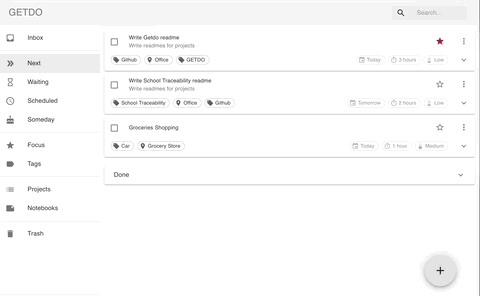
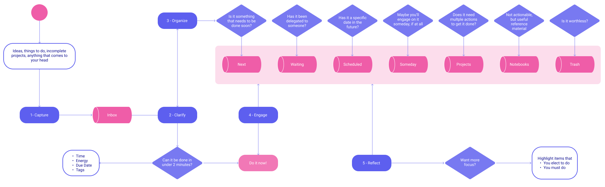
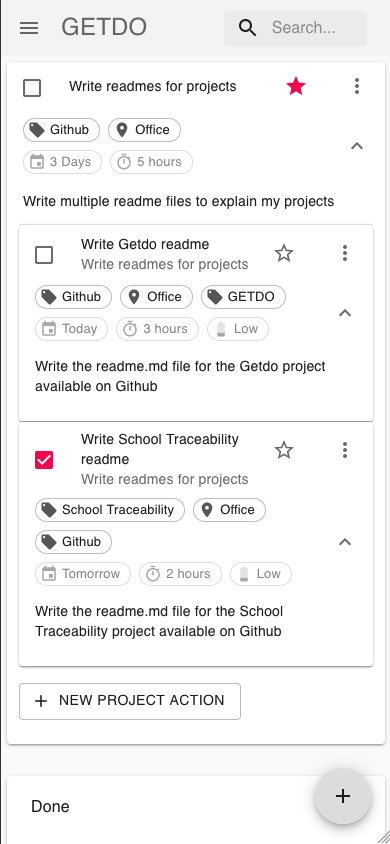
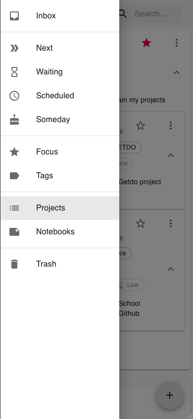
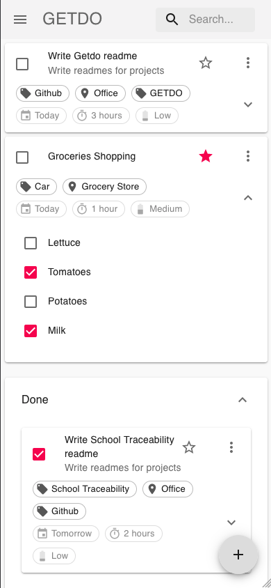
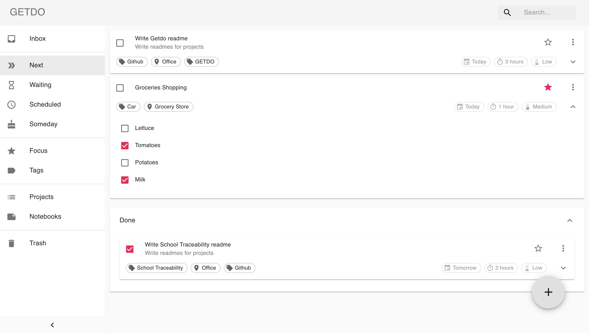
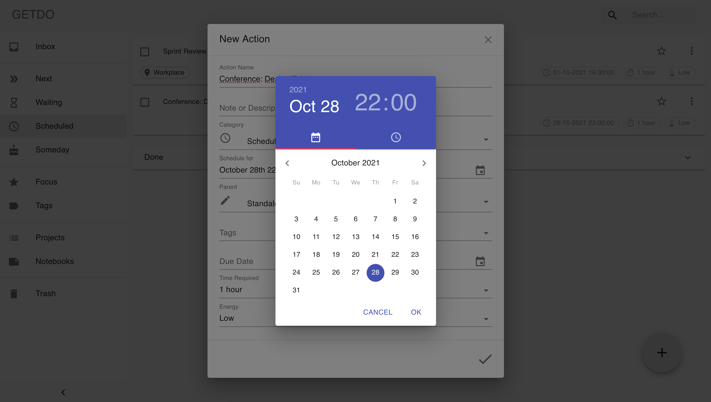
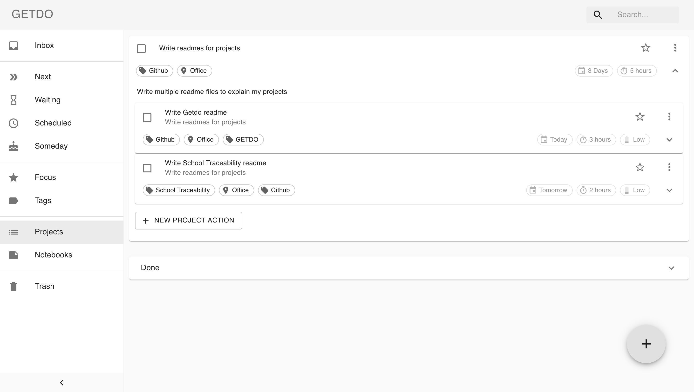
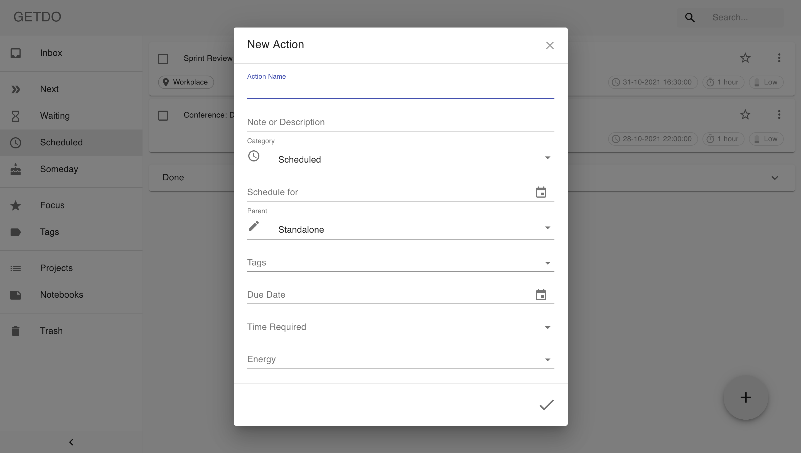
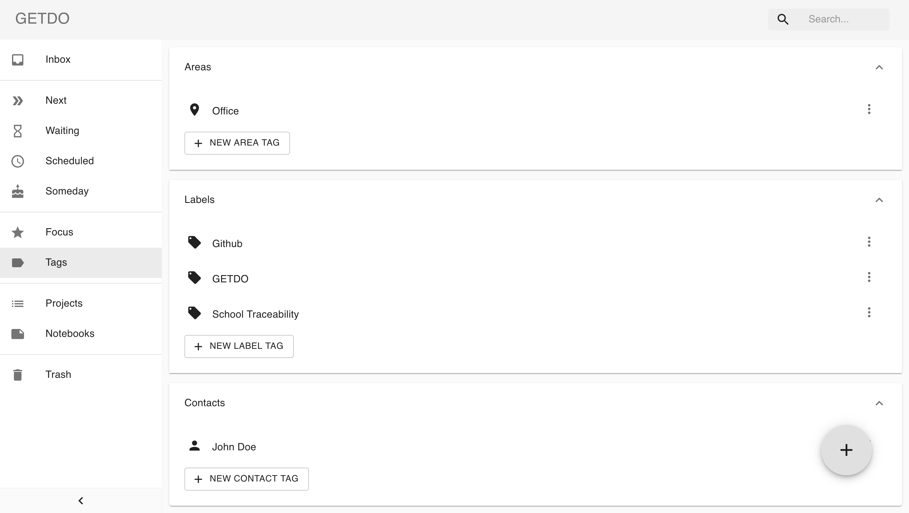

<p align="center">
 
</p>

<h2 align="center">GETDO</h2>

<div align="center">

  []() 
  [](https://github.com/crisemcon/Getdo)
  [](https://github.com/crisemcon/Getdo/pulls)
  [](/LICENSE)

</div>

---

<p align="center"> Task manager built for the Getting Things Done® productivity system, designed to help you capture, clarify, organize, reflect and engage your day to day.
    <br> 
</p>
<p align="center">

</p>


---
## 📝 Table of Contents
- [About](#about)
- [Built With](#built_with)
- [Getting Started](#getting_started)
- [Usage](#usage)
- [Screenshots](#screenshots)
<!--- [Deployment](#deployment)-->
<!--
- [TODO](../TODO.md)
- [Contributing](../CONTRIBUTING.md)
- [Authors](#authors)
- [Acknowledgments](#acknowledgement)
-->

---
## 🧐 About <a name = "about"></a>
GETDO is a responsive web application designed to make Getting Things Done easy and sustainable. It has all the tools needed to follow the method, including projects, next actions lists, contexts, time and energy labels, areas, and more. 

---
## ⛏️ Built With <a name = "built_with"></a>
- [React.js](https://reactjs.org//) - Web Framework
- [MongoDB](https://www.mongodb.com/) - Database
- [Express](https://expressjs.com/) - Server Framework
- [NodeJs](https://nodejs.org/en/) - Server Environment
- [MaterialUI](https://mui.com/) - React UI library
- [JSON Web Tokens](https://jwt.io/) - Access Credentials
- [BCrypt](https://github.com/kelektiv/node.bcrypt.js) - End-to-end password encryption

---
## 🏁 Getting Started <a name = "getting_started"></a>
These instructions will get you a copy of the project up and running on your local machine for development and testing purposes.<!-- See [deployment](#deployment) for notes on how to deploy the project on a live system. -->


### Prerequisites

- Node.js - [Download & Install Node.js](https://nodejs.org/en/download/) and the npm package manager. If you encounter any problems, you can also use this [GitHub Gist](https://gist.github.com/isaacs/579814) to install Node.js.
- MongoDB - [Download & Install MongoDB](http://www.mongodb.org/downloads), and make sure it's running on the default port (27017).


### Installing
A step by step series of examples that tell you how to get a development env running.

To install the client dependencies, run this in both the getdo-client and getdo-server folders from the command-line:

```
npm install
```

If you are not running a local MongoDB cluster on the default port, configure it manually in the file getdo-server/variables.env

```
DB_MONGO="YOUR MONGODB URI"
```

To run the server application, navigate to the getdo-server folder and run this in the command-line:
```
npm run dev
```
To run the client application, navigate to the getdo-client folder and run this in another command-line:
```
npm start
```

Notice that you need client and server runs concurrently in different terminal session, in order to make them communicate to each other.

<!--
## 🔧 Running the tests <a name = "tests"></a>
Explain how to run the automated tests for this system.

### Break down into end to end tests
Explain what these tests test and why

```
Give an example
```

### And coding style tests
Explain what these tests test and why

```
Give an example
```
-->
---
## 🎈 Usage <a name="usage"></a>
If you are unfamiliar with the GTD productivity system, you can start by reading this [quick introduction](https://www.asianefficiency.com/task-management/gtd-intro/).

Here is a diagram that illustrates a common productivity workflow based on the Getting Things Done system:

<p align="center">
 
</p>

---
## 📷 Screenshots <a name="screenshots"></a>

### 📱 Mobile
<div>
    
    
    
</div>

### 🖥 Desktop
<div>
    
    
    
    
    
</div>

<!--## 🚀 Deployment <a name = "deployment"></a>
Add additional notes about how to deploy this on a live system.
-->


<!-- 
## ✍️ Authors <a name = "authors"></a>
- [@crisemcon](https://github.com/crisemcon)

See also the list of [contributors](https://github.com/kylelobo/The-Documentation-Compendium/contributors) who participated in this project. 

## 🎉 Acknowledgements <a name = "acknowledgement"></a>
- Hat tip to anyone whose code was used
- Inspiration
- References

-->